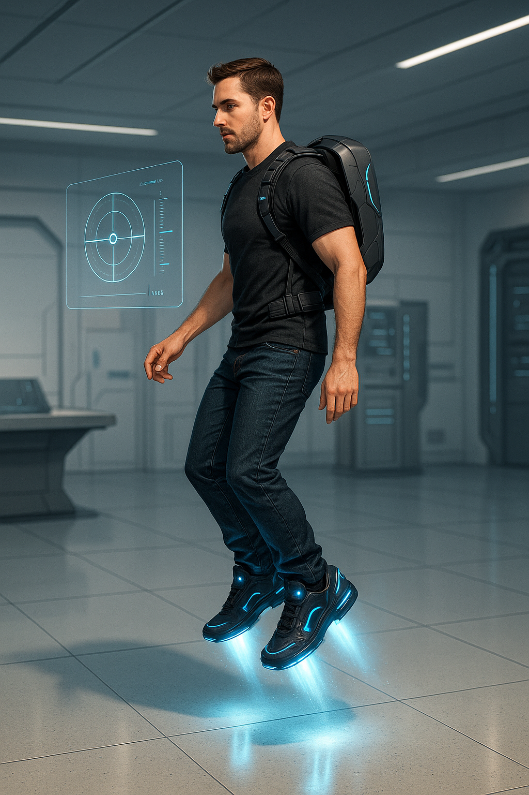
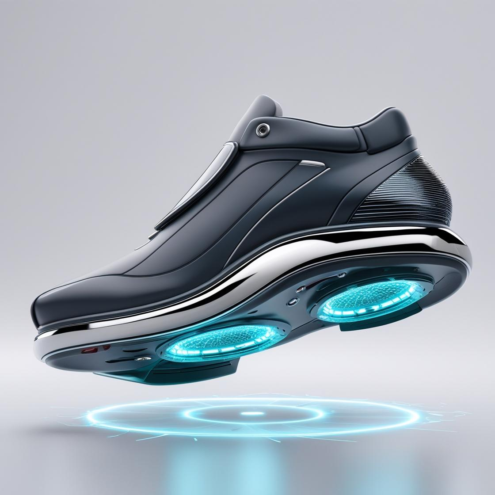
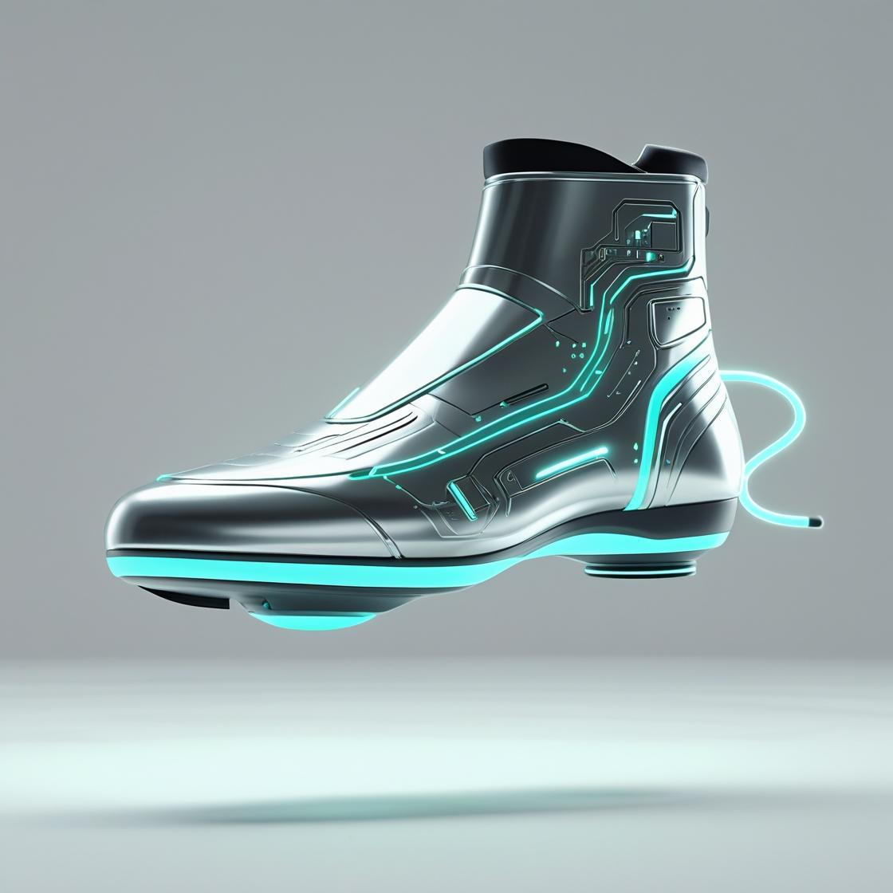

# -nograve-concept

 Futuristic wearable air mobility concept to enable walking in the air.
## Features
- Concept-stage air-walking device
- Focus on anti-gravity-inspired propulsion and gravitational field modulation
- Sustainable urban mobility solution
- Pre-patent design and research underway

## Status
Currently in concept and feasibility research phase.

## Technologies / Areas
Concept Design, Urban Mobility, Innovation, Patent Research

---

## How to Contribute or Learn More
Feel free to contact me or check my LinkedIn profile for updates and collaboration opportunities.
